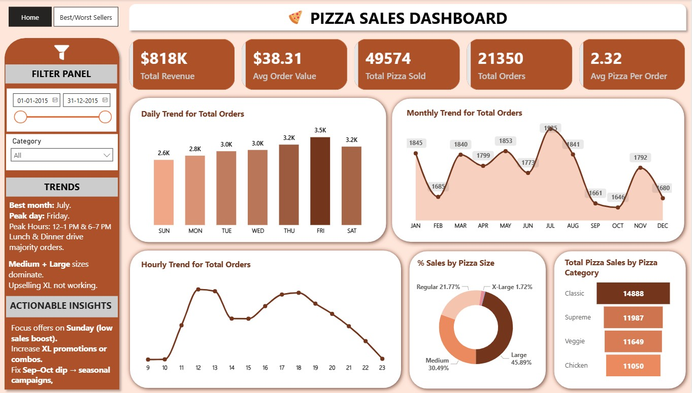
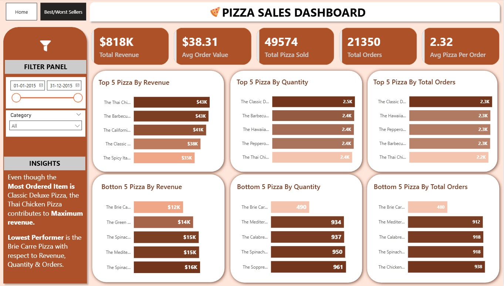

# Pizza Sales Analysis (SQL + Power BI)

## Project Overview

This project analyzes pizza sales data to understand business performance, customer behavior, and product-level trends. The goal is to extract meaningful insights from raw data and present them using an interactive Power BI dashboard.

## Tools Used

- PostgreSQL (Data analysis using SQL)
- Power BI (Data visualization and dashboarding)

## Key Metrics

- Total Revenue: $818K  
- Average Order Value: $38.31  
- Total Orders: 21,350  
- Total Pizzas Sold: 49,574  
- Average Pizzas per Order: 2.32  

## Analysis Performed

- Daily and monthly order trends.
- Hourly order pattern to identify peak business hours.
- Sales distribution by pizza size and category.  
- Top and bottom performing pizzas based on revenue, quantity, and orders.
  
## Key Insights

- Friday records the highest number of orders, while Sunday has lower demand.  
- Peak order hours are during lunch (12–1 PM) and dinner (6–7 PM). 
- July is the best performing month, while sales dip in September and October.  
- Large and Medium pizzas dominate overall sales. 
- Thai Chicken Pizza generates the highest revenue.  
- Brie Carre Pizza is the lowest performing item.  

## Business Recommendations

- Introduce offers during low-demand hours (2–4 PM).  
- Focus on improving Sunday sales through targeted promotions.  
- Increase upselling strategies for larger pizza sizes.  
- Optimize operations based on peak hours.  

## Project Structure

- `data/` – Raw dataset  
- `sql/` – SQL queries used for analysis and its documentation 
- `dashboard_powerbi/` – Power BI dashboard file and analysis file.
- Business requirement document.  
- `images/` – Dashboard screenshots. 

## How to Use

1. Load the dataset into PostgreSQL.  
2. Run queries from the `sql/` folder.
3. Open the Power BI file to explore the dashboard.
